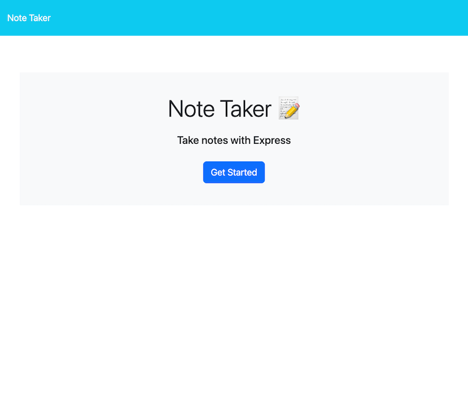
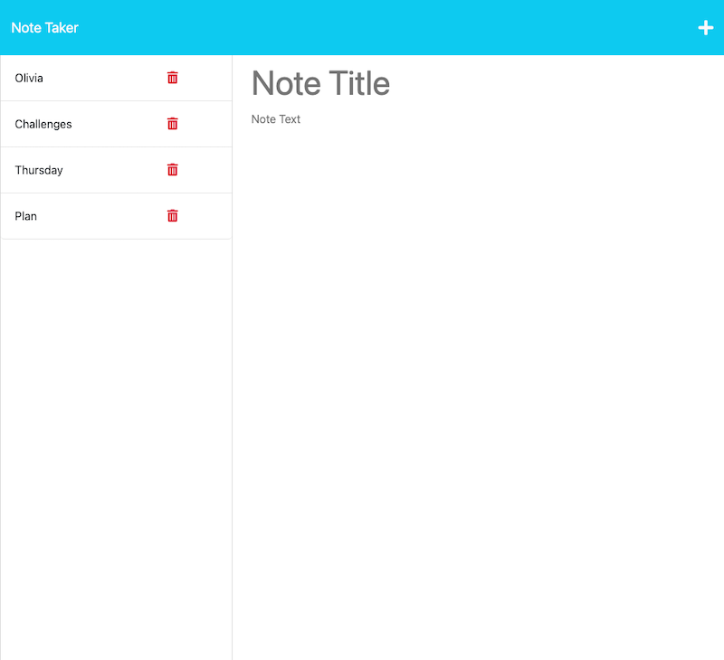

# [Note-Taker](https://github.com/Saidou25/Note-Taker-)

## Table of Contents

- [Description](#description)

- [Usage](#usage)

- [Resources](#resources)

- [Visuals](#visuals)

## Description

This app is built to allow users to add save and view notes added to a web page. Is a planner.

## Usage

From the introduction page press the "get started" button and start planning and writing your notes. You choose a title from the "Title" fiels and enter your notes from the "Text" field and then hit the save icon. You can then view your notes by clicking any of the titles fron the left side of the screen.

## Resources

This project was created using node, javascript and express.

## Visuals

Here are a couple of screenshots of the application.

View of the introductionary page:

View of in use page with few saved notes:

## Questions

For questions and comments please contact [Sy25](https://github.com/Saidou25/Note-Taker-).